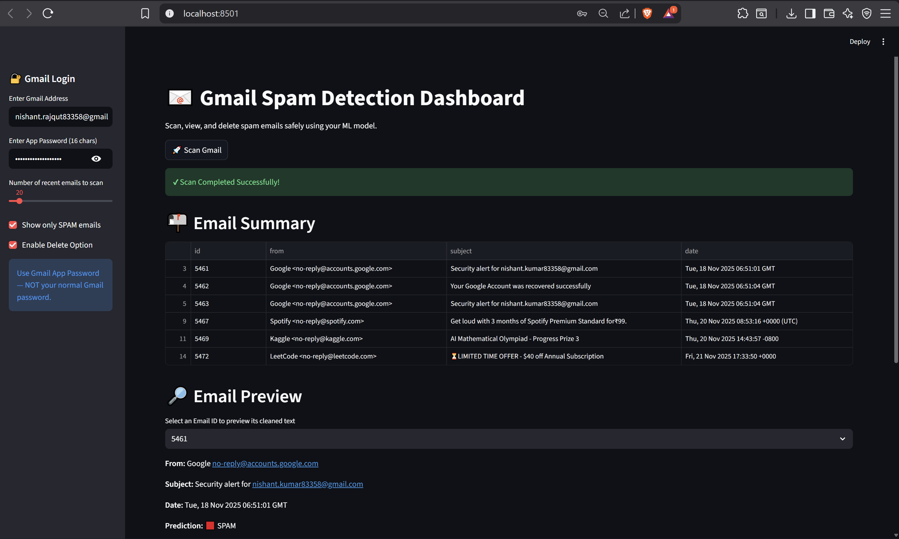

## Gmail Spam Detection Dashboard



### Overview  
This project connects directly to Gmail via IMAP, cleans incoming messages with a custom NLP pipeline, and classifies them as spam or ham using a scikit-learn model. A Streamlit dashboard sits on top of a lightweight Flask API so you can review suspicious emails, inspect the cleaned text, and even delete spam without leaving your browser.

### Key Features
- `Scan Gmail inbox` with a Gmail App Password and configurable fetch limit.
- `ML-powered spam scoring` using a TF-IDF vectorizer + serialized classifier.
- `Cleaned text preview` so HTML-heavy or obfuscated spam is readable.
- `One-click delete` (optional safeguard) to purge spam directly from Gmail.
- `Notebook + datasets` for retraining (`cleaning_data.ipynb`, `spam_assassin.csv`, `spam_cleaned_final.csv`).

### Tech Stack
- **Backend:** Python, Flask, IMAPLib, joblib, NLTK  
- **Frontend:** Streamlit, Requests, Pandas  
- **Modeling:** scikit-learn pipeline serialized to `backend/model/`

### Project Structure
```
backend/
  app.py                # Flask API for scan/delete
  gmail_utils.py        # IMAP logic, text cleaning, prediction
  model/
    spam_model.joblib
    vectorizer.joblib
frontend/
  streamlit_app.py      # Dashboard UI
cleaning_data.ipynb     # Data prep + training workflow
spam_assassin.csv       # Raw dataset
spam_cleaned_final.csv  # Processed dataset
image.png               # Dashboard screenshot
```

### Prerequisites
- Python 3.10+ (virtual environment recommended)
- Gmail account with 2FA enabled and an **App Password** (16 characters)
- IMAP access enabled inside Gmail settings (`Settings → Forwarding and POP/IMAP`)

### 1. Backend Setup
```bash
cd backend
python -m venv .venv
.venv\Scripts\activate  # macOS/Linux: source .venv/bin/activate
pip install flask imapclient nltk joblib scikit-learn
python -c "import nltk; nltk.download('stopwords'); nltk.download('wordnet')"
python app.py
```
The API listens on `http://localhost:5000`.

### 2. Frontend Setup
```bash
cd frontend
python -m venv .venv
.venv\Scripts\activate
pip install streamlit pandas requests
streamlit run streamlit_app.py
```
The dashboard opens in your browser (default `http://localhost:8501`). Update `backend_url` inside `streamlit_app.py` if you deploy the API elsewhere.

### Using the Dashboard
1. Enter your Gmail address and 16-character App Password in the sidebar.  
2. Pick how many recent emails to scan (5–200).  
3. Hit **Scan Gmail**. Filter spam-only results, inspect senders, subjects, and cleaned bodies.  
4. (Optional) Toggle **Enable Delete Option** to remove a flagged email directly from Gmail.

> **Security tip:** Never use your normal Gmail password. Create/revoke App Passwords from https://myaccount.google.com/apppasswords whenever needed.

### Retraining the Model
1. Explore `cleaning_data.ipynb` to see the preprocessing workflow.  
2. Update `spam_assassin.csv` (raw) or `spam_cleaned_final.csv` (processed) with new samples.  
3. Refit your vectorizer/classifier, then overwrite `backend/model/spam_model.joblib` and `vectorizer.joblib`.

### Troubleshooting
- **`Missing credentials`** → Ensure both email and App Password fields are filled.  
- **`Backend error occurred`** → Verify the Flask server is running and accessible from the Streamlit host.  
- **NTLK resource errors** → Rerun the download commands listed in Backend Setup.  
- **Delete fails** → Gmail may delay IMAP flag updates; rescan after 30 seconds.

### Future Ideas
- OAuth-based Gmail access (no App Passwords).  
- Scheduled scans + notifications.  
- Model monitoring and auto-retraining hooks.  
- Containerized deployment (Docker Compose for API + UI).

---
Crafted by **Nishant Rajput** · Feel free to open issues or PRs!

